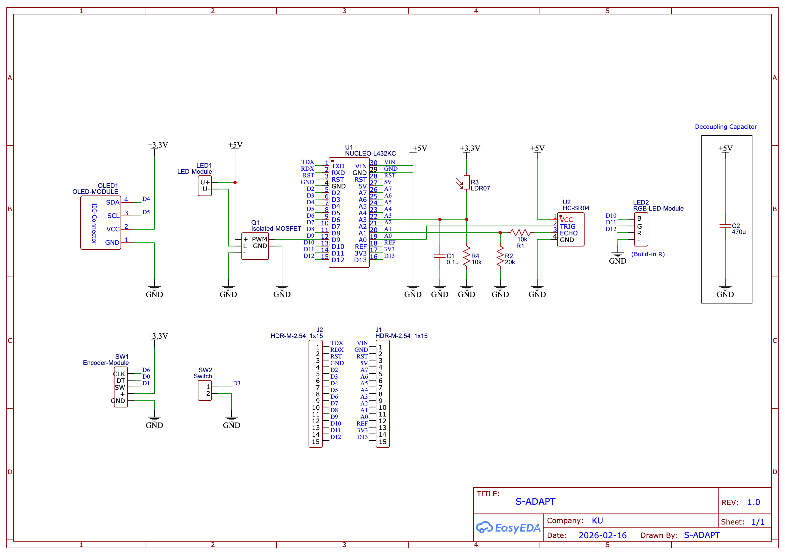

# 💡S-ADAPT

`S-ADAPT` (Sensing-based Automated Dimming for Ambient-aware Presence-Tracked Lighting) is an STM32 firmware project for adaptive desk lighting on NUCLEO-L432KC, driven by ambient light and user presence.
This repository is the implementation for the class project in `01204323 Electronic Laboratory for Embedded Systems` (Computer Engineering, Kasetsart University).

## 📚 Table of Contents

- [💡S-ADAPT](#s-adapt)
  - [📚 Table of Contents](#-table-of-contents)
  - [🚀 Release Status](#-release-status)
  - [🎓 Academic Context](#-academic-context)
    - [👥 Team](#-team)
  - [✨ Features](#-features)
  - [🛠️ Hardware](#️-hardware)
  - [🧩 Hardware Overview](#-hardware-overview)
    - [Power Topology Note](#power-topology-note)
  - [📌 Pin Map (MCU + Nucleo Alias)](#-pin-map-mcu--nucleo-alias)
  - [🖥️ Software Stack / Libraries](#️-software-stack--libraries)
  - [🧭 Build](#-build)
  - [⏱️ Runtime Overview](#️-runtime-overview)
  - [📖 Documentation](#-documentation)


## 🚀 Release Status

- Current release target: `v1.1.1`
- Runtime owner: `app` layer (`app_init`, `app_step`)
- Hardware-first bring-up is complete, with integrated baseline business logic and OLED runtime UI.

## 🎓 Academic Context

- Project: `S-ADAPT` (Sensing-based Automated Dimming for Ambient-aware Presence-Tracked Lighting)
- Course: `01204323 Electronic Laboratory for Embedded Systems`
- Program: Computer Engineering, Kasetsart University
- Academic term: Year 3, Term 2

### 👥 Team

- `6610502218` Rajata Thamcharoensatit ([@RJTPP](https://github.com/RJTPP))
- `6610502170` Phutthiphong Rodboung ([@PRennis](https://github.com/PRennis))
- `6610505471` Pitiphum Yingwongwiwat ([@Kanomgenez](https://github.com/Kanomgenez))
- `6610505403` Tanapatr Karnjanarujivut ([@zennnne](https://github.com/zennnne))

## ✨ Features

- Ambient sensing from LDR (ADC) with moving average filter.
- Presence sensing from HC-SR04 ultrasonic with median filter and reference-based presence engine.
- Main lamp PWM output control with:
  - `AUTO + manual_offset`
  - hysteresis deadband
  - output ramp limiting
- RGB status LED state signaling.
- OLED runtime UI:
  - Page 0 `MAIN`
  - Page 1 `SENSOR`
  - temporary offset overlay on encoder rotation
  - event/data-driven redraw with capped OLED update rate
- Settings subsystem:
  - modal settings mode via `BUTTON` long-press (`1000 ms`)
  - encoder browse/edit interaction with value-token invert focus
  - explicit `Save` / `Reset` / `Exit` draft workflow
  - persistent user config in internal flash (append-only records with CRC)

## 🛠️ Hardware

- MCU board: STM32 NUCLEO-L432KC
- Ultrasonic: HC-SR04
- Display: SSD1306 OLED (I2C)
- Ambient sensor: LDR + divider
- Main light driver: isolated MOSFET module input (PWM control, shared lamp power rail)
- Inputs: rotary encoder (`CLK/DT/SW`) + extra page button

## 🧩 Hardware Overview



### Power Topology Note

- The reference build in this repo uses an **isolated MOSFET** module (`Q1`) for PWM control, with LED load supply and MCU board supply tied to the same `+5V` rail (common `GND`) for wiring simplicity.
- You can keep this single-rail setup, or split MCU and LED into separate power rails.
- A common reason to split rails is when the LED/load uses a different voltage (for example `12V` or `24V`) while MCU control remains at `5V`/`3.3V`.
- For both options, keep common ground between MCU and LED driver so PWM control has a stable reference.
- Place decoupling per domain:
  - MCU decoupling near MCU supply input,
  - bulk/load decoupling near LED driver/load path.

## 📌 Pin Map (MCU + Nucleo Alias)

| Function | MCU Pin | Nucleo Alias | Firmware Symbol |
|---|---|---|---|
| HC-SR04 TRIG | `PA0` | `A0` | `TRIG_Pin` |
| HC-SR04 ECHO (`TIM2_CH2`) | `PA1` | `A1` | `ECHO_TIM2_CH2_Pin` |
| LDR ADC input (`ADC1_IN9`) | `PA4` | `A3` | `ADC1_IN9` (no GPIO macro) |
| OLED I2C SCL | `PB6` | `D5` | `OLED_I2C_SCL_Pin` |
| OLED I2C SDA | `PB7` | `D4` | `OLED_I2C_SDA_Pin` |
| Main LED PWM (`TIM1_CH1`) | `PA8` | `D9` | `Main_LED_TIM1_CH1_Pin` |
| RGB Status R | `PB4` | `D12` | `LED_Status_R_Pin` |
| RGB Status G | `PB5` | `D11` | `LED_Status_G_Pin` |
| RGB Status B | `PA11` | `D10` | `LED_Status_B_Pin` |
| Encoder CLK | `PB1` | `D6` | `ENCODER_CLK_EXTI1_Pin` |
| Encoder DT | `PA10` | `D0` | `ENCODER_DT_EXTI10_Pin` |
| Encoder SW | `PA9` | `D1` | `ENCODER_PRESS_Pin` |
| Page button | `PB0` | `D3` | `BUTTON_Pin` |

## 🖥️ Software Stack / Libraries

- STM32Cube HAL + CMSIS ([`S-ADAPT/Drivers/`](S-ADAPT/Drivers/))
- SSD1306 OLED library (adapted from [afiskon/stm32-ssd1306](https://github.com/afiskon/stm32-ssd1306)):
  - [`S-ADAPT/Core/Src/ssd1306.c`](S-ADAPT/Core/Src/ssd1306.c)
  - [`S-ADAPT/Core/Src/ssd1306_fonts.c`](S-ADAPT/Core/Src/ssd1306_fonts.c)
  - [`S-ADAPT/Core/Inc/ssd1306.h`](S-ADAPT/Core/Inc/ssd1306.h)
- Application modules under:
  - [`S-ADAPT/Core/Src/app`](S-ADAPT/Core/Src/app)
  - [`S-ADAPT/Core/Src/bsp`](S-ADAPT/Core/Src/bsp)
  - [`S-ADAPT/Core/Src/sensors`](S-ADAPT/Core/Src/sensors)
  - [`S-ADAPT/Core/Src/input`](S-ADAPT/Core/Src/input)
  - [`S-ADAPT/Core/Src/support`](S-ADAPT/Core/Src/support)

## 🧭 Build

Preferred: STM32CubeIDE build ([`Debug`](S-ADAPT/Debug) / [`Release`](S-ADAPT/Release)) in [`S-ADAPT/`](S-ADAPT/).

> [!NOTE]
> STM32CubeIDE compatibility:
> - validated on `v1.19.0`.
> - `v2.x.x` is currently untested in this repository. Starting with `v2.0.0`, STM32CubeMX is a separate standalone tool, so the workflow differs.

Clone and enter the repository:

```bash
git clone https://github.com/RJTPP/S-ADAPT-IoT.git
cd S-ADAPT-IoT
```

Headless build (if installed):

```bash
stm32cubeide --launcher.suppressErrors -nosplash \
  -application org.eclipse.cdt.managedbuilder.core.headlessbuild \
  -data "$PWD/.workspace" -import "$PWD/S-ADAPT" -build S-ADAPT/Debug
```

Headless build (macOS app bundle path):

```bash
"/Applications/STM32CubeIDE.app/Contents/MacOS/stm32cubeide" --launcher.suppressErrors -nosplash \
  -application org.eclipse.cdt.managedbuilder.core.headlessbuild \
  -data "$PWD/.workspace" -import "$PWD/S-ADAPT" -build S-ADAPT/Debug
```

## ⏱️ Runtime Overview

- Control tick: `33 ms`
- LDR sample: `50 ms` (decoupled)
- Ultrasonic sample: `100 ms` (decoupled)
- Summary UART diagnostics: `1 s`
- OLED:
  - dirty/event + data-change driven redraw
  - capped to ~15 FPS (`66 ms` minimum interval)
  - periodic fallback refresh `1 s`

## 📖 Documentation

- Docs index: [`docs/README.md`](docs/README.md)
- User guide: [`docs/user-guide.md`](docs/user-guide.md)
- Feature matrix: [`docs/feature-matrix.md`](docs/feature-matrix.md)
- Architecture: [`docs/architecture/Architecture.md`](docs/architecture/Architecture.md)
- Business logic: [`docs/architecture/business-logic.md`](docs/architecture/business-logic.md)
- Planning checklist: [`docs/planning/planning-checklist.md`](docs/planning/planning-checklist.md)
- Test checklist: [`docs/planning/test-checklist.md`](docs/planning/test-checklist.md)
