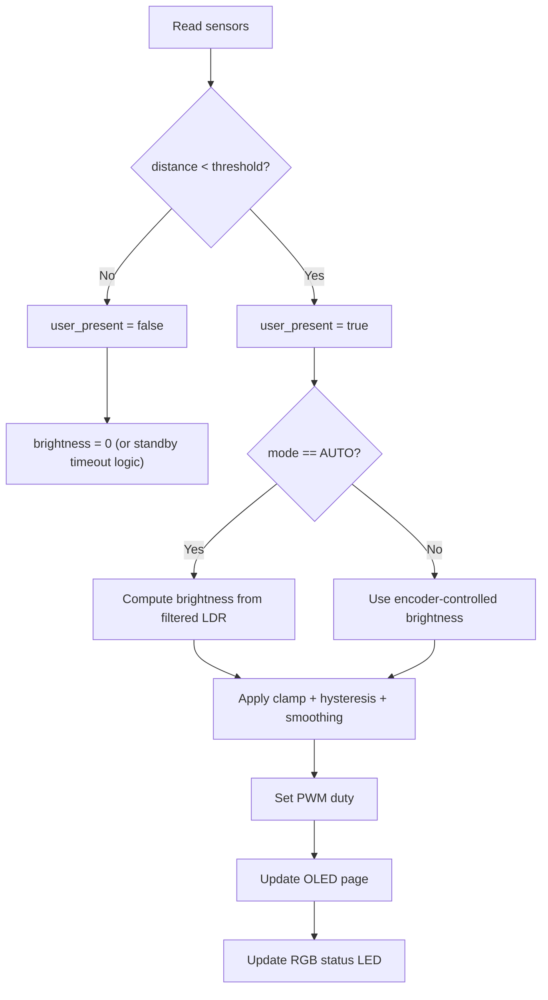
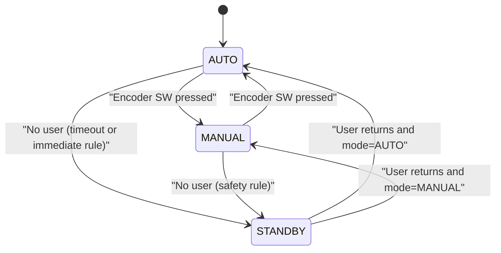

# S-ADAPT Business Logic

## Target Feature Behavior
- Adaptive lamp control using ambient light (LDR) and user presence (HC-SR04).
- Mode switching: `AUTO` and `MANUAL`.
- OLED multi-page status display.
- RGB LED indicates system state.

## Power-On Defaults
- `Mode = AUTO`
- `Brightness = 50%`
- `OLED Page = 0`

## Core State Variables
- `mode`: `AUTO` or `MANUAL`
- `user_present`: boolean from distance threshold
- `distance_cm`: filtered ultrasonic distance
- `ldr_raw` / `ldr_filtered`
- `brightness_percent`: `0..100`
- `oled_page`: `0..N-1`
- `last_presence_ms`: timestamp for optional delayed standby

## Main Control Flow

## Mode Logic
### AUTO
- Input: filtered LDR.
- Rule: darker room -> higher brightness, brighter room -> lower brightness.
- Recommended map: `brightness = map(ldr_filtered, dark->100, bright->20)`.
- Clamp output to configured min/max.

### MANUAL
- Encoder CW: increment brightness.
- Encoder CCW: decrement brightness.
- LDR is ignored.
- Encoder push toggles `AUTO <-> MANUAL`.

## Presence Logic
- Threshold example: `80 cm` (calibrate on real hardware).
- If not present:
- immediate off: `brightness = 0`
- or delayed off: apply timeout window (e.g., 30 s)

## OLED Page Logic
- Extra button increments page index.
- Formula: `page = (page + 1) % TOTAL_PAGES`.
- Suggested pages:
- Page 0: mode + brightness
- Page 1: LDR raw/filtered
- Page 2: distance + presence
- Page 3: debug/system info

## RGB Status Mapping (Target)
- Blue: `AUTO`
- Green: `MANUAL`
- Red: `No user / standby`
- Purple: setup/special mode

Current code note:
- Distance-based RGB thresholds are still active and should be migrated to state-based mapping in a dedicated task.

## State Diagram

