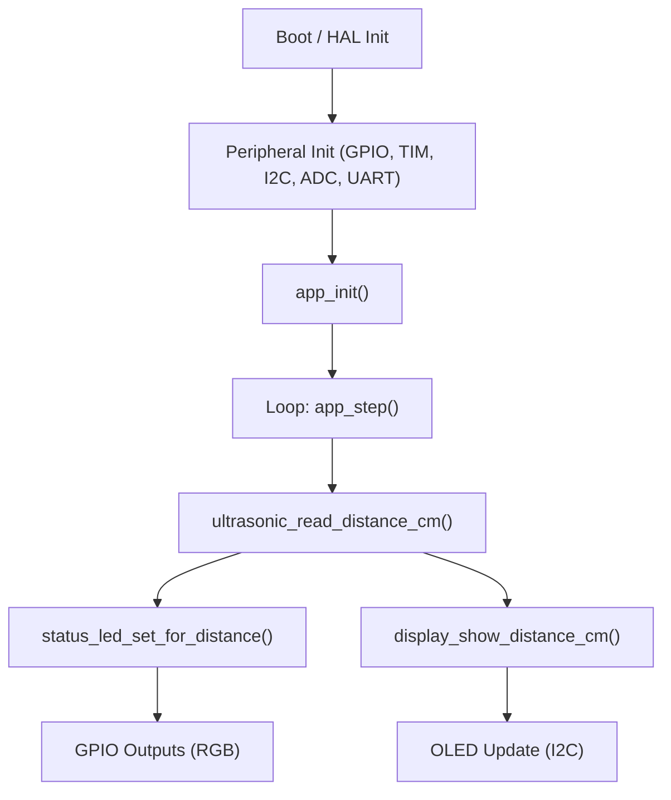

# S-ADAPT Architecture

## Purpose
This document defines the current firmware architecture and hardware-to-code mapping for S-ADAPT.

## Hardware Map
| Hardware | Role | MCU Signal | Firmware Symbol |
|---|---|---|---|
| HC-SR04 TRIG | Ultrasonic trigger output | PA0 | `TRIG_Pin` |
| HC-SR04 ECHO | Ultrasonic echo input capture | PA1 / TIM2_CH2 | `ECHO_TIM2_CH2_Pin` |
| OLED SDA | I2C data | PB7 | `OLED_I2C_SDA_Pin` |
| OLED SCL | I2C clock | PB6 | `OLED_I2C_SCL_Pin` |
| Main LED PWM | Lamp brightness control | PA8 / TIM1_CH1 | `Main_LED_TIM1_CH1_Pin` |
| RGB Status R | Status indication | PA5 | `LED_Status_R_Pin` |
| RGB Status G | Status indication | PA6 | `LED_Status_G_Pin` |
| RGB Status B | Status indication | PA7 | `LED_Status_B_Pin` |
| Encoder CLK | User input | PB1 | `ENCODER_CLK_EXTI1_Pin` |
| Encoder DT | User input | PA10 | `ENCODER_DT_EXTI10_Pin` |
| Encoder SW | User input | PA9 | `SW_Pin` |
| Extra button | Page switch input | PB0 | `BUTTON_Pin` |

## Firmware Modules
| Module | Main Files | Responsibility |
|---|---|---|
| App orchestration | `S-ADAPT/Core/Src/app.c` | Main runtime step, connects sensor, display, and status outputs |
| Ultrasonic driver | `S-ADAPT/Core/Src/ultrasonic.c` | TRIG pulse, TIM2 input capture, timeout/noise handling, distance conversion |
| Display driver facade | `S-ADAPT/Core/Src/display.c` | OLED init and page rendering calls |
| Status LED control | `S-ADAPT/Core/Src/status_led.c` | RGB indication behavior and fatal error blink |
| Platform init | `S-ADAPT/Core/Src/main.c` | CubeMX init, app startup, infinite loop |

## Runtime Data Flow

## Timing Model (Current)
| Activity | Current cadence |
|---|---|
| Main loop tick | ~33 ms (`HAL_Delay(33)`) |
| Ultrasonic measurement | Once per loop |
| OLED update | Once per loop |

## Planned Direction
- Keep module boundaries stable.
- Add business logic layer for `AUTO + manual_offset`, light ON/OFF toggling, and page switching.
- Keep hardware drivers separate from policy decisions.
