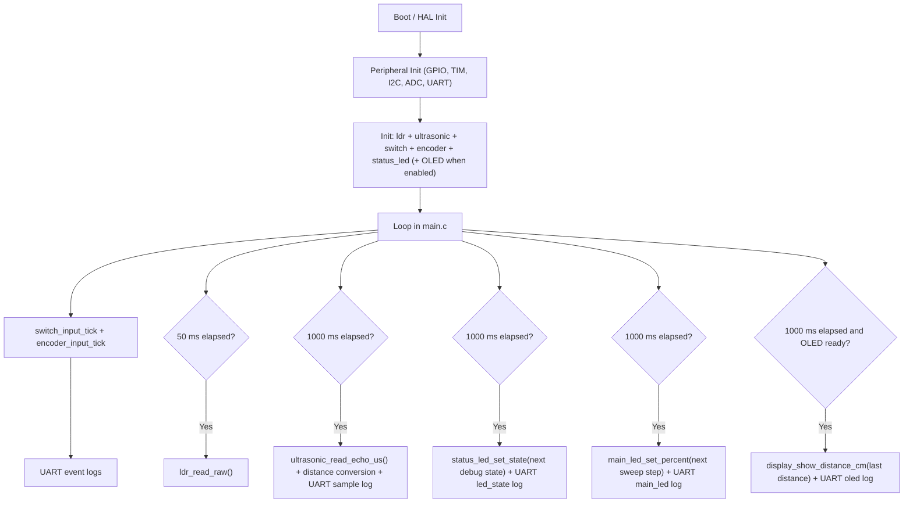

# S-ADAPT Architecture

## Purpose
This document defines the current firmware architecture and hardware-to-code mapping for S-ADAPT.

## Hardware Map
| Hardware | Role | MCU Signal | Firmware Symbol |
|---|---|---|---|
| HC-SR04 TRIG | Ultrasonic trigger output | PA0 | `TRIG_Pin` |
| HC-SR04 ECHO | Ultrasonic echo input capture | PA1 / TIM2_CH2 | `ECHO_TIM2_CH2_Pin` |
| OLED SDA | I2C data | PB7 | `OLED_I2C_SDA_Pin` |
| OLED SCL | I2C clock | PB6 | `OLED_I2C_SCL_Pin` |
| Main LED PWM | Lamp brightness control | PA8 / TIM1_CH1 | `Main_LED_TIM1_CH1_Pin` |
| RGB Status R | Status indication | PB4 | `LED_Status_R_Pin` |
| RGB Status G | Status indication | PB5 | `LED_Status_G_Pin` |
| RGB Status B | Status indication | PA11 | `LED_Status_B_Pin` |
| Encoder CLK | User input | PB1 | `ENCODER_CLK_EXTI1_Pin` |
| Encoder DT | User input | PA10 | `ENCODER_DT_EXTI10_Pin` |
| Encoder SW | User input | PA9 | `ENCODER_PRESS_Pin` |
| Extra button | Page switch input | PB0 | `BUTTON_Pin` |

## Firmware Modules
| Module | Main Files | Responsibility |
|---|---|---|
| Switch input debounce | `S-ADAPT/Core/Src/input/switch_input.c` | Poll `BUTTON`/`SW2`, debounce transitions, queue switch events |
| Main LED PWM driver | `S-ADAPT/Core/Src/bsp/main_led.c` | TIM1 CH1 PWM output control (`0..100%`) for MOSFET-driven lamp |
| Ultrasonic driver | `S-ADAPT/Core/Src/sensors/ultrasonic.c` | TRIG pulse, TIM2 input capture, timeout/noise handling, distance conversion |
| Display driver facade | `S-ADAPT/Core/Src/bsp/display.c` | OLED init and rendering calls via `ssd1306.c` |
| Status LED control | `S-ADAPT/Core/Src/bsp/status_led.c` | RGB indication and error blink support |
| Platform runtime | `S-ADAPT/Core/Src/main.c` | CubeMX init, runtime scheduling, bring-up debug loops/logs for LDR/US/RGB/OLED/main LED |
| App orchestration (future) | `S-ADAPT/Core/Src/app/app.c` | Reserved for higher-level business logic orchestration |

## Runtime Data Flow

## Timing Model (Current)
| Activity | Current cadence |
|---|---|
| Main loop pacing | `HAL_Delay(1)` |
| Switch sampling | 10 ms (`SWITCH_SAMPLE_PERIOD_MS`) |
| Switch debounce confirmation | 30 ms (`SWITCH_DEBOUNCE_TICKS` x sample period) |
| Ultrasonic measurement | 1000 ms (`US_SAMPLE_PERIOD_MS`) |
| LDR sampling | 50 ms (`LDR_SAMPLE_PERIOD_MS`) |
| OLED debug update | 1000 ms (`OLED_DEBUG_PERIOD_MS`, when enabled) |
| RGB debug state cycle | 1000 ms (`RGB_DEBUG_PERIOD_MS`) |
| UART switch logs | On debounced transitions only |
| UART ultrasonic logs | Once per ultrasonic tick |

## Known Bring-Up Note
- A branch-level bring-up issue was observed with RGB on `PA5/PA6/PA7`: enabling those channels caused OLED I2C timeout/busy (`HAL_I2C` error `0x20`).
- Remapping RGB to `PB4/PB5/PA11` resolved OLED stability in the current hardware setup.

## Planned Direction
- Keep module boundaries stable.
- Keep hardware drivers separate from policy decisions.
- Hardware bring-up is mostly complete; next is baseline business logic integration.
- Implement baseline control loop first (presence gate + LDR->brightness + ON/OFF + offset application).
- Add moving-average/median/hysteresis immediately after baseline loop is stable on hardware.
- Move scheduling/orchestration from `main.c` to `app.c` when business logic integration starts.
