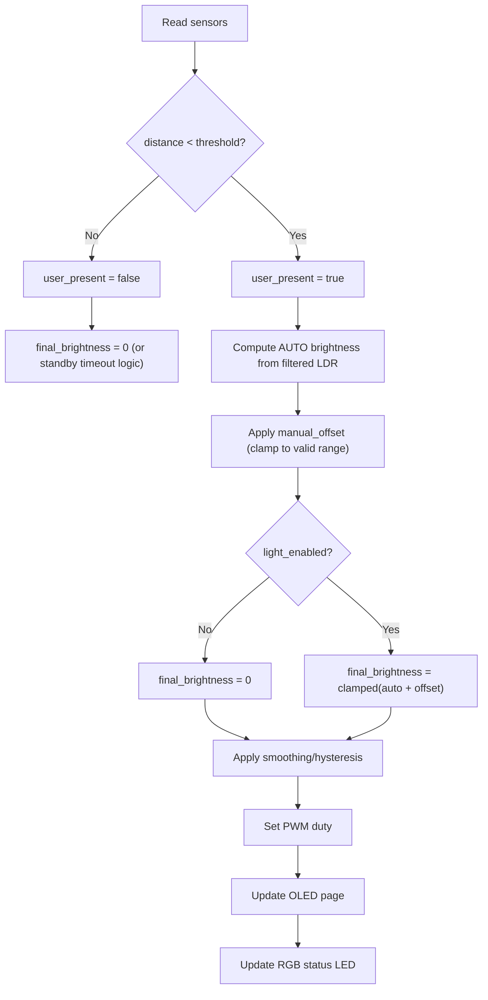

# S-ADAPT Business Logic

## Target Feature Behavior
- Adaptive lamp control using ambient light (LDR) and user presence (HC-SR04).
- Control model: `AUTO + manual_offset` (single mode).
- OLED multi-page status display.
- RGB LED indicates system state.

## Power-On Defaults
- `Mode = AUTO`
- `manual_offset = 0`
- `Light = OFF` (PWM forced to 0 until user toggles ON)
- `OLED Page = 0`

## Core State Variables
- `mode`: `AUTO`
- `light_enabled`: boolean ON/OFF
- `manual_offset`: signed brightness offset (e.g. `-30..+30`)
- `user_present`: boolean from distance threshold
- `distance_cm`: filtered ultrasonic distance
- `ldr_raw` / `ldr_filtered`
- `auto_brightness_percent`: `0..100`
- `final_brightness_percent`: `0..100`
- `oled_page`: `0..N-1`
- `last_presence_ms`: timestamp for optional delayed standby

## Main Control Flow


## AUTO Brightness Logic
- Input: filtered LDR.
- Rule: darker room -> higher brightness, brighter room -> lower brightness.
- Recommended map: `auto_brightness = map(ldr_filtered, dark->100, bright->20)`.
- Clamp output to configured min/max.

## Encoder Logic
- Encoder CW: increment `manual_offset`.
- Encoder CCW: decrement `manual_offset`.
- Offset is applied on top of AUTO brightness and clamped.
- Single click: toggle light ON/OFF.
- Double click: reset `manual_offset = 0`.

## Presence Logic
- Threshold example: `80 cm` (calibrate on real hardware).
- If not present:
- immediate off: `final_brightness = 0`
- or delayed off: apply timeout window (e.g., 30 s)

## OLED Page Logic
- Extra button increments page index.
- Formula: `page = (page + 1) % TOTAL_PAGES`.
- Suggested pages:
- Page 0: AUTO + offset + final brightness
- Page 1: LDR raw/filtered
- Page 2: distance + presence
- Page 3: debug/system info

## Temporary Offset Overlay (UX)
- On encoder rotation, OLED should temporarily override current page with an offset UI.
- Overlay content example: `Offset: +12%` and resulting brightness.
- Overlay timeout example: `~1200 ms` after the last encoder step.
- If encoder rotates again before timeout, extend/restart overlay timeout.
- After timeout, return to the previously active OLED page.

## RGB Status Mapping (Target)
- Blue: AUTO running
- Green: light enabled with positive offset
- Red: `No user / standby`
- Purple: setup/special/debug mode

Current code note:
- Distance-based RGB thresholds are still active and should be migrated to state-based mapping in a dedicated task.

## State Diagram
```mermaid
stateDiagram-v2
    [*] --> AUTO_OFF
    AUTO_OFF --> AUTO_ON: "Single click (light ON)"
    AUTO_ON --> AUTO_OFF: "Single click (light OFF)"
    AUTO_ON --> STANDBY: "No user (timeout or immediate rule)"
    AUTO_OFF --> STANDBY: "No user (optional policy)"
    STANDBY --> AUTO_OFF: "User returns; wait for single click"
```
