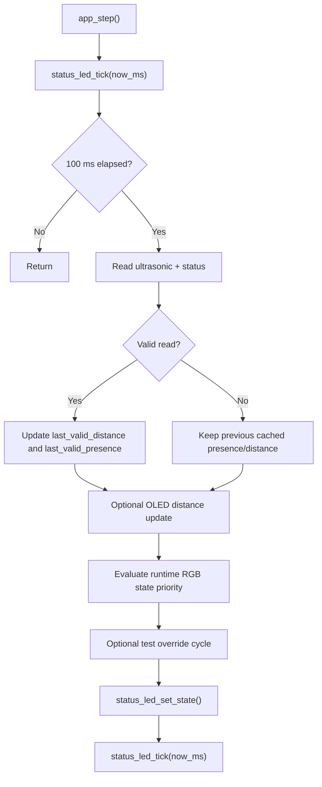

# S-ADAPT Business Logic

## Target Feature Behavior
- Adaptive lamp control using ambient light (LDR) and user presence (HC-SR04).
- Control model: `AUTO + manual_offset` (single mode).
- OLED multi-page status display.
- RGB LED indicates system state.

## Current Implementation Snapshot (RGB-First Phase)
- RGB state machine is implemented and active.
- App loop uses a 100 ms software tick (`APP_LOOP_TICK_MS`).
- Presence cache uses ultrasonic validity checks and only updates on valid reads.
- OLED displays distance when display init succeeds.
- Fatal init path enables non-blocking red blink via status LED module.
- Temporary RGB validation mode is enabled by default (`APP_RGB_TEST_MODE = 1`).

## Power-On Defaults (Current)
- `Mode = AUTO`
- `manual_offset = 0`
- `Light = OFF` (represented by `light_enabled = 0`)
- `distance_cm` initialized to error value (`999`)

## Core State Variables (Current Subset)
- `mode`: `AUTO`
- `light_enabled`: boolean ON/OFF
- `manual_offset`: signed brightness offset (e.g. `-30..+30`)
- `last_valid_presence`: boolean from distance threshold (`80 cm`)
- `last_valid_distance_cm`: last valid ultrasonic value
- `fatal_fault`: fatal status flag for RGB blink override

## Main Control Flow (Current)

## Presence Logic (Current)
- Threshold example: `80 cm` (calibrate on real hardware).
- Presence cache only changes when ultrasonic returns `ULTRASONIC_STATUS_OK`.
- On transient ultrasonic failure, cached presence is held (no RGB flicker from invalid samples).

## RGB Mapping (Current)
- `BOOT_SETUP` -> Purple
- `AUTO` -> Blue
- `OFFSET_POSITIVE` -> Green
- `NO_USER` -> Red
- `FAULT_FATAL` -> blinking Red

## RGB Priority (Current)
1. `FAULT_FATAL`
2. `BOOT_SETUP` for first `1000 ms` after init
3. `NO_USER` when `light_enabled == 1` and `last_valid_presence == 0`
4. `OFFSET_POSITIVE` when `light_enabled == 1` and `manual_offset > 0`
5. `AUTO`

## Temporary RGB Validation Mode
- Compile-time flag: `APP_RGB_TEST_MODE`.
- Current setting: enabled for board validation.
- Behavior when enabled:
- every `1000 ms`, override runtime color with cycle:
- `AUTO -> OFFSET_POSITIVE -> NO_USER -> BOOT_SETUP -> repeat`
- `FAULT_FATAL` still has highest priority and is not overridden.

## Legacy Compatibility Status
- `status_led_set_for_distance()` remains as a deprecated wrapper for legacy callers.
- `status_led_blink_error()` remains as a shim and routes into non-blocking fatal blink handling.

## Remaining Work To Reach Full Target Logic
- Add LDR sampling and filtered AUTO brightness computation.
- Apply PWM output control path with clamp/smoothing.
- Implement encoder/button input logic (single click, double click, offset steps).
- Implement OLED multi-page and temporary offset overlay behavior.

## Target State Diagram (Planned)

