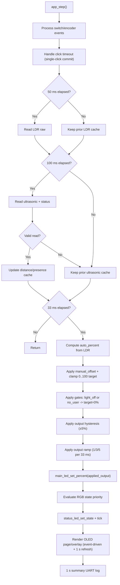

# S-ADAPT Business Logic

## Target Feature Behavior
- Adaptive lamp control using ambient light (LDR) and user presence (HC-SR04).
- Control model: `AUTO + manual_offset` (single mode).
- OLED multi-page status display.
- RGB LED indicates system state.

## Current Implementation Snapshot (Baseline Logic Phase)
- Runtime owner is now `app.c` (`app_init` + `app_step`).
- Main LED output is driven by baseline policy (`AUTO + manual_offset`) instead of debug sweep.
- Stability layer is active:
- LDR moving average (`N=8`).
- Ultrasonic median filter (`N=3`) for distance/presence input.
- PWM output hysteresis deadband (`±5%`).
- PWM output ramp limiter (normal `1%`, turn-on `3%`, turn-off `5%` per control tick) applied after hysteresis.
- Presence engine uses reference capture + away/stale timers instead of a single fixed threshold.
- Pre-off dim stage is active before no-user off (`min(current,15%)` for `5 s` in current debug-timer profile).
- Encoder switch release drives single/double click behavior:
- single click toggles light ON/OFF (after double-click window timeout).
- double click resets `manual_offset` to `0`.
- Encoder rotation adjusts offset only while light is ON.
- Presence gate uses ultrasonic with hold-last-valid behavior on transient read failures.
- RGB state now follows runtime policy (no test cycle override).
- UART emits a consolidated 1-second summary log for tuning.
- OLED runtime UI is active:
- Persistent pages: `MAIN` and `SENSOR`, switched by `BUTTON` release.
- Offset overlay appears on encoder rotation and timeout starts at `1200 ms`.
- Overlay uses adaptive offset animation and remains visible until animation reaches target, then holds for ~`750 ms` before exit.
- Display refresh is data/event-driven with 1-second periodic refresh fallback.
- OLED redraw is rate-limited to ~15 FPS (`66 ms` minimum draw interval).
- Settings mode is available as a modal OLED flow:
  - enter/exit with `BUTTON` long-press (`1000 ms`)
  - encoder rotate to move/select/edit
  - explicit `Save`/`Reset`/`Exit` actions
  - edit focus inverts value token only
- User settings persistence is active on internal flash:
  - append-only records with `magic/version/seq/crc`
  - one reserved flash page (`0x0803F800`, `2 KB`)
  - boot loads latest valid record, else falls back to defaults

## Power-On Defaults (Current)
- `Mode = AUTO`
- `manual_offset = 0`
- `Light = OFF` (represented by `light_enabled = 0`)
- `distance_cm` initialized to error value (`999`)

## Core State Variables (Current Subset)
- `control model`: implicit `AUTO + manual_offset` (no runtime mode enum variable)
- `light_enabled`: boolean ON/OFF
- `manual_offset`: signed brightness offset (`-50..+50`)
- `last_valid_presence`: boolean from reference-based ultrasonic presence engine
- `last_valid_distance_cm`: last valid ultrasonic value
- `fatal_fault`: fatal status flag for RGB blink override

## Main Control Flow (Current)

## Settings Mode and Persistence (Current)
- Entry: `BUTTON` long-press (`1000 ms`) toggles settings mode.
- While settings mode is active:
  - normal page cycling is suspended
  - encoder click/rotate are routed to settings UI
  - offset overlay is hidden
- Draft model:
  - edits go to draft settings only
  - runtime behavior changes only after `Save`
  - `Exit` discards unsaved draft edits
- Persisted fields (v1):
  - away/flat mode enable
  - away timeout
  - stale timeout
  - pre-off dim duration
  - away return band
- Save path:
  - validate draft
  - append new flash record with incremented sequence
  - if page full: erase page then write fresh record

## Presence Logic (Current)
- Runtime cadence: control `33 ms`, LDR sampling `50 ms` (decoupled), ultrasonic sampling `100 ms`.
- On each OFF->ON click:
- set fallback reference `ref_distance_cm=60`
- mark pending capture, then replace with first valid filtered distance.
- Away detection:
- if `distance > ref + 20 cm` continuously for `5 s` (current debug-timer profile), trigger no-user candidate.
- Stale detection:
- if step-to-step movement stays within `±1 cm` for `15 s` (current debug-timer profile), trigger no-user candidate.
- Pre-off dim before no-user commit:
- drive output to `min(current_output,15%)` for `5 s` (debug-tunable in build config).
- if user returns/moves during this window, cancel pre-off and keep present.
- Recovery after no-user:
- away reason: return when `distance <= ref + 10 cm` for ~`1.5 s` confirm window.
- flat reason: return on movement spike (`>=2 cm` step delta).
- On transient ultrasonic failure, keep last valid presence and do not advance timers.

Note: if `APP_PRESENCE_DEBUG_TIMERS` is set to `0`, the production timing profile becomes away `30 s`, stale `120 s`, and pre-off dim `10 s`.

## RGB Mapping (Current)
- `BOOT_SETUP` -> Purple
- `LIGHT_OFF` -> Red
- `AUTO` -> Blue
- `OFFSET_POSITIVE` -> Green (used for any non-zero manual offset in baseline)
- `NO_USER` -> Yellow
- `FAULT_FATAL` -> blinking Red

## RGB Priority (Current)
1. `FAULT_FATAL`
2. `BOOT_SETUP` for first `1000 ms` after init
3. `LIGHT_OFF` when `light_enabled == 0`
4. `NO_USER` when `light_enabled == 1` and `last_valid_presence == 0`
5. `OFFSET_POSITIVE` when `light_enabled == 1` and `manual_offset != 0`
6. `AUTO`

## RGB Validation Mode
- Debug RGB override cycle is removed from primary runtime path.
- RGB now reflects runtime state only.

## Legacy Compatibility Status
- `status_led_set_for_distance()` remains as a deprecated wrapper for legacy callers.
- `status_led_blink_error()` remains as a shim and routes into non-blocking fatal blink handling.

## Remaining Work To Reach Full Target Logic
- Additional UI tuning and threshold calibration.
- Presence policy refinement (if needed from field testing).

## Implementation Order (Locked for Next Phase)
1. Baseline control loop (no advanced filtering): correct behavior first.
2. Filtering/hysteresis utilities: improve stability without changing intent.
3. UI polish and tuning: OLED page model, debug reduction, threshold tuning on board.

## Target State Diagram (Planned)

