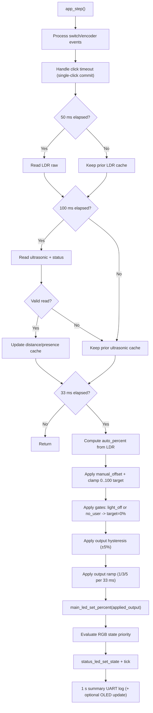

# S-ADAPT Business Logic

## Target Feature Behavior
- Adaptive lamp control using ambient light (LDR) and user presence (HC-SR04).
- Control model: `AUTO + manual_offset` (single mode).
- OLED multi-page status display.
- RGB LED indicates system state.

## Current Implementation Snapshot (Baseline Logic Phase)
- Runtime owner is now `app.c` (`app_init` + `app_step`).
- Main LED output is driven by baseline policy (`AUTO + manual_offset`) instead of debug sweep.
- Stability layer is active:
- LDR moving average (`N=8`).
- Ultrasonic median filter (`N=3`) for distance/presence input.
- PWM output hysteresis deadband (`±5%`).
- PWM output ramp limiter (normal `1%`, turn-on `3%`, turn-off `5%` per control tick) applied after hysteresis.
- Encoder switch release drives single/double click behavior:
- single click toggles light ON/OFF (after double-click window timeout).
- double click resets `manual_offset` to `0`.
- Encoder rotation adjusts offset only while light is ON.
- Presence gate uses ultrasonic with hold-last-valid behavior on transient read failures.
- RGB state now follows runtime policy (no test cycle override).
- UART emits a consolidated 1-second summary log for tuning.

## Power-On Defaults (Current)
- `Mode = AUTO`
- `manual_offset = 0`
- `Light = OFF` (represented by `light_enabled = 0`)
- `distance_cm` initialized to error value (`999`)

## Core State Variables (Current Subset)
- `mode`: `AUTO`
- `light_enabled`: boolean ON/OFF
- `manual_offset`: signed brightness offset (e.g. `-30..+30`)
- `last_valid_presence`: boolean from distance threshold (`80 cm`)
- `last_valid_distance_cm`: last valid ultrasonic value
- `fatal_fault`: fatal status flag for RGB blink override

## Main Control Flow (Current)

## Presence Logic (Current)
- Threshold example: `80 cm` (calibrate on real hardware).
- Presence cache only changes when ultrasonic returns `ULTRASONIC_STATUS_OK`.
- Presence decision input is median-filtered ultrasonic distance (`N=3`).
- On transient ultrasonic failure, cached presence is held (no RGB flicker from invalid samples).
- Presence hysteresis is not enabled in this phase (deferred).
- Forced-off paths (`manual OFF` / `no-user`) now ramp down output to 0 (not immediate cut).
- Runtime cadence: control `33 ms`, LDR sampling `50 ms` (decoupled), ultrasonic sampling `100 ms`.

## RGB Mapping (Current)
- `BOOT_SETUP` -> Purple
- `LIGHT_OFF` -> Red
- `AUTO` -> Blue
- `OFFSET_POSITIVE` -> Green (used for any non-zero manual offset in baseline)
- `NO_USER` -> Yellow
- `FAULT_FATAL` -> blinking Red

## RGB Priority (Current)
1. `FAULT_FATAL`
2. `BOOT_SETUP` for first `1000 ms` after init
3. `LIGHT_OFF` when `light_enabled == 0`
4. `NO_USER` when `light_enabled == 1` and `last_valid_presence == 0`
5. `OFFSET_POSITIVE` when `light_enabled == 1` and `manual_offset != 0`
6. `AUTO`

## RGB Validation Mode
- Debug RGB override cycle is removed from primary runtime path.
- RGB now reflects runtime state only.

## Legacy Compatibility Status
- `status_led_set_for_distance()` remains as a deprecated wrapper for legacy callers.
- `status_led_blink_error()` remains as a shim and routes into non-blocking fatal blink handling.

## Remaining Work To Reach Full Target Logic
- Presence-level hysteresis (if needed after tuning) is deferred.
- UX extensions:
- OLED multi-page model and temporary offset overlay behavior.
- Additional UI tuning and threshold calibration.

## Implementation Order (Locked for Next Phase)
1. Baseline control loop (no advanced filtering): correct behavior first.
2. Filtering/hysteresis utilities: improve stability without changing intent.
3. UI polish and tuning: OLED page model, debug reduction, threshold tuning on board.

## Target State Diagram (Planned)

